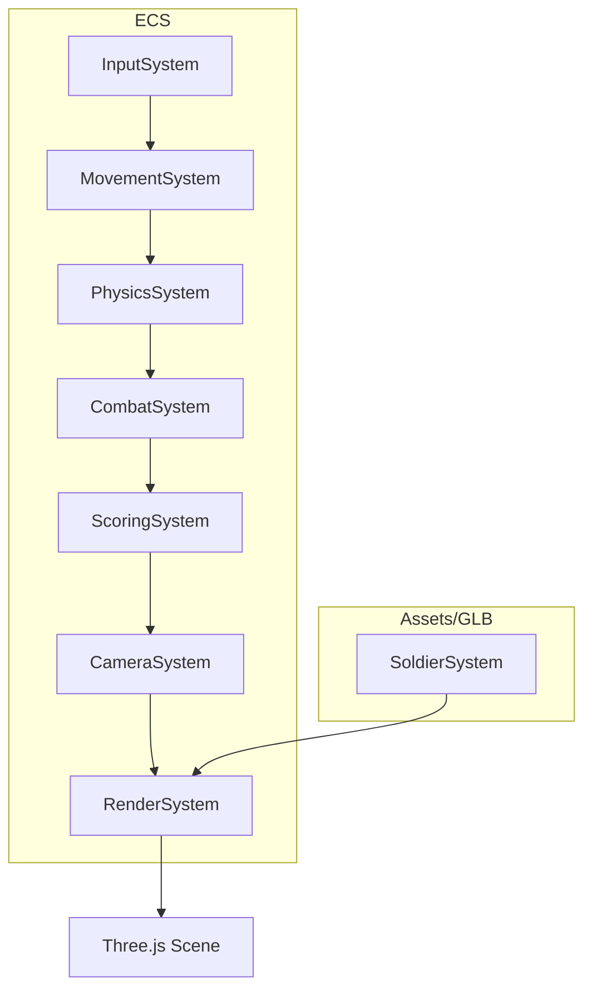

# Three.js Shooter • Rapier ECS Prototype

Modern WebGL shooter prototype using Three.js + an Entity Component System and Rapier physics, with a deterministic fixed-step loop suitable for gameplay correctness and replay determinism.

[Quick Start](#quick-start) • [Features](#features) • [Tech Stack](#tech-stack) • [Install/Run Matrix](#installrun-matrix) • [Architecture](#architecture) • [Physics API](#physicssystem-api-quick-reference) • [Collision Layers](#collision-layers--masks) • [Systems](#system-responsibilities) • [Examples](#examples) • [Roadmap Graph](#roadmap-graph) • [Gantt Plan](#gantt-plan) • [Troubleshooting](#troubleshooting) • [Contributing](#contributing) • [Future Scope](#future-scope) • [License](#license)

---

## Shields

<p align="left">
  
  
  
  
  
  
  
</p>

---

## Features

| Capability | Status | Notes |
|---|---:|---|
| Rapier physics via `@dimforge/rapier3d-compat` | ✅ | Async WASM init, world lifecycle managed by PhysicsSystem |
| Deterministic fixed-step loop | ✅ | Accumulator loop at 60 Hz, render decoupled |
| ECS architecture | ✅ | Deterministic system order for correctness |
| Kinematic/dynamic control | ✅ | Kinematic player control; impulses for dynamics |
| Raycast-based interactions | ✅ | PhysicsSystem.raycast returning entity hits |
| Collision layers/masks | 🚧 | Scaffolding provided; codify masks per TASKS.md process |
| Movement/Camera/Combat integration | 🚧 | P1 tasks tracked in TASKS.md |

See detailed progress and acceptance policies in ["TASKS.md"](TASKS.md:1).

---

## Quick Start

Prereqs
- Node 18+ and a modern browser with WebAssembly enabled.

Install & Run
```bash
# install
npm install

# dev server (Vite)
npm run dev
# open the printed local URL and click the canvas to lock pointer
```

Controls (prototype)
- WASD move, Space jump (tuning WIP), Shift sprint intent wired, Mouse look.
- Shooting/aim are migrating to Rapier raycasts.

---

## Tech Stack

<p align="left">
  
  
  
  
  
  
</p>

---

## Install/Run Matrix

| Task | Command |
|---|---|
| Install deps | `npm install` |
| Dev server | `npm run dev` |
| Build (if configured) | `npm run build` |
| Lint | `npm run lint` |
| Typecheck | `npm run typecheck` |

---

## Architecture

- ECS
  - Components: Transform (Position, Rotation), Physics (RigidBody, Collider, Velocity intent), Gameplay (Weapon, Aim, Score), Rendering (Mesh)
  - Systems: Input → Movement → Physics → Combat → Scoring → Camera → Render → Soldier

- Deterministic update loop
  - 60 Hz fixed dt (accumulator) in game loop
  - Physics steps are fixed; render runs once per frame

- Physics (Rapier)
  - Bodies created from RigidBodyComponent and optional ColliderComponent
  - Entity ↔ body/collider handle mapping
  - Kinematic player uses setNextKinematicTranslation; dynamics use impulses/linvel
  - Raycasts via world.castRay, returned as entity/toi/point

Key files
- Entry/game loop: ["src/main.ts"](src/main.ts:1)
- Physics system: ["src/systems/PhysicsSystem.ts"](src/systems/PhysicsSystem.ts:1)
- Physics component schemas: ["src/components/PhysicsComponents.ts"](src/components/PhysicsComponents.ts:1)
- System registration: ["src/systems/index.ts"](src/systems/index.ts:1)
- Plan & status: ["TASKS.md"](TASKS.md:1)

---

## Deterministic Fixed-Step Loop (Summary)

- Accumulate real time each RAF
- While accumulator ≥ dt (1/60), run system pipeline for one tick
- Render once after stepping
- Avoid per-frame allocations in systems; reuse temp vectors

Minimal pattern
```ts
// ["src/main.ts"](src/main.ts:1)
const FIXED_DT = 1 / 60;
let acc = 0;
let last = perfNow();

function frame() {
  const now = perfNow();
  acc += (now - last) / 1000;
  last = now;

  while (acc >= FIXED_DT) {
    // run ECS systems in deterministic order
    // Input -> Movement -> Physics -> Combat -> Scoring -> Camera -> Render
    acc -= FIXED_DT;
  }

  // one render pass per RAF
  requestAnimationFrame(frame);
}
requestAnimationFrame(frame);
```

---

## PhysicsSystem API (Quick Reference)

| API | Purpose | Notes |
|---|---|---|
| `init()` | Load Rapier WASM and create world | Async; call before stepping |
| `createOrUpdateBody(entityId)` | Create/update body and colliders from ECS components | Reads RigidBodyComponent and ColliderComponent |
| `removeBody(entityId)` | Despawn physics artifacts | Cleans handle maps and colliders |
| `step(dt)` | Step physics world at fixed dt | Syncs transforms back to ECS |
| `setVelocity(entityId, v3)` | Set kinematic/dynamic velocity | Kinematic: next translation; dynamic: linvel |
| `applyImpulse(entityId, v3)` | Apply impulse to dynamic body | Use for jump/shoot impacts |
| `raycast(origin, dir, maxToi?, solid?, filterGroups?)` | Raycast in physics world | Returns `{ entityId, toi, point }` if hit |

Usage snippets
```ts
// Create a dynamic cube body + collider from components
// ["src/components/PhysicsComponents.ts"](src/components/PhysicsComponents.ts:1)
const cube = createEntity();
addRigidBody(cube, { kind: 'dynamic', ccd: true });
addCuboidCollider(cube, { hx: 0.5, hy: 0.5, hz: 0.5 });

// Ensure physics creates/updates the body
// ["src/systems/PhysicsSystem.ts"](src/systems/PhysicsSystem.ts:1)
physicsSystem.createOrUpdateBody(cube);

// Apply an impulse (e.g., kick)
physicsSystem.applyImpulse(cube, { x: 0, y: 5, z: 0 });

// Hitscan
const hit = physicsSystem.raycast(origin, dir, 100.0, true /*solid*/);
if (hit) {
  // compute world-space hit point
  const point = {
    x: origin.x + dir.x * hit.toi,
    y: origin.y + dir.y * hit.toi,
    z: origin.z + dir.z * hit.toi,
  };
}
```

---

## Collision Layers & Masks

Scaffolded bitmask plan (to be finalized per ["TASKS.md"](TASKS.md:1) process using the gamethinking MCP planning step):

| Layer | Bit | Mask (example) | Collides With (example) |
|---|---:|---:|---|
| PLAYER | 0 | `0b00001` | ENV, ENEMY, CAMERA_BLOCKER |
| ENEMY | 1 | `0b00010` | ENV, PLAYER |
| ENV | 2 | `0b00100` | PLAYER, ENEMY, BULLET |
| CAMERA_BLOCKER | 3 | `0b01000` | PLAYER (camera rays) |
| BULLET | 4 | `0b10000` | ENEMY, ENV |

Integration points
```ts
// Collider groups (example): ["src/components/PhysicsComponents.ts"](src/components/PhysicsComponents.ts:1)
const groups = { /* compute layer bitfields */ };
// colliderDesc.setCollisionGroups(groups.collision);
```

- ColliderComponent: set `collisionGroups/solverGroups/activeCollisionTypes`
- Raycast: pass `filterGroups` to restrict intersections
- Camera: cast from player to camera, include `CAMERA_BLOCKER`

Finalize exact masks after the MCP planning step and codify in code + TASKS.md.

---

## System Responsibilities

| System | Responsibilities | Key Interactions |
|---|---|---|
| Input | Poll devices, write intents to ECS | Movement, Combat |
| Movement | Convert intents to kinematic/dynamic control | PhysicsSystem.setVelocity/applyImpulse |
| Physics | World step, sync transforms, raycasts | Rapier world lifecycle |
| Combat | Hitscan/projectiles via raycast | Collider → entity resolution |
| Camera | Follow/smooth, camera-blocker raycasts | Uses `CAMERA_BLOCKER` layer |
| Render | Write-only ECS → Three transforms | Avoid physics coupling |
| Soldier | Character model/animation hooks | Reads movement state |

---

## Examples

Run scripts
```bash
npm run dev
npm run lint
npm run typecheck
```

Create a kinematic player (pattern)
```ts
// ["src/systems/PhysicsSystem.ts"](src/systems/PhysicsSystem.ts:1)
const player = createEntity();
addRigidBody(player, { kind: 'kinematicVelocityBased', lockRot: { x: true, y: false, z: true } });
addCapsuleCollider(player, { halfHeight: 0.9, radius: 0.35 });

// In MovementSystem: set velocity intent per tick
physicsSystem.setVelocity(player, { x: moveX, y: moveY, z: moveZ });
```

Raycast for camera collision
```ts
// ["src/systems/CameraSystem.ts"](src/systems/CameraSystem.ts:1)
const hit = physicsSystem.raycast(playerPos, camDir, maxToi, true /*solid*/, /*filterGroups*/);
if (hit) camera.position.copy(hit.point); // clamp camera to hit point
```



---

## Current Work Graph

Visual dependency graph of current and near-term work.  
Legend: ✅ done, 🚧 in-progress, 🎯 planned, 🔒 policy/process gate.

```mermaid
graph TD

    10["User<br>External Actor"]
    subgraph 1["Build &amp; Config System<br>TypeScript/Node.js"]
        35["Vite Config<br>Vite"]
        36["ESLint Config<br>ESLint"]
        39["Styles<br>Tailwind CSS"]
        subgraph 2["HTML Entry Point<br>HTML"]
            37["Root index.html<br>HTML"]
            38["Public index.html<br>HTML"]
        end
        subgraph 3["TypeScript Config<br>TypeScript"]
            33["tsconfig.json<br>TypeScript"]
            34["tsconfig.node.json<br>TypeScript"]
        end
        subgraph 4["Package Management<br>npm"]
            31["package.json<br>npm"]
            32["package-lock.json<br>npm"]
        end
        %% Edges at this level (grouped by source)
        35["Vite Config<br>Vite"] -->|Bundles| 2["HTML Entry Point<br>HTML"]
        35["Vite Config<br>Vite"] -->|Processes| 39["Styles<br>Tailwind CSS"]
        4["Package Management<br>npm"] -->|Manages dependencies for| 3["TypeScript Config<br>TypeScript"]
        4["Package Management<br>npm"] -->|Manages dependencies for| 35["Vite Config<br>Vite"]
        4["Package Management<br>npm"] -->|Manages dependencies for| 36["ESLint Config<br>ESLint"]
        3["TypeScript Config<br>TypeScript"] -->|Configures compilation for| 35["Vite Config<br>Vite"]
    end
    subgraph 5["ECS Core System<br>TypeScript"]
        22["Entity Manager<br>TypeScript"]
        23["Base System<br>TypeScript"]
        subgraph 6["Core Types &amp; Utilities<br>TypeScript"]
            29["Core Types<br>TypeScript"]
            30["Collision Layers<br>TypeScript"]
        end
        subgraph 7["Component Types<br>TypeScript"]
            24["ComponentType Enum<br>TypeScript"]
            25["Gameplay Components<br>TypeScript"]
            26["Physics Components<br>TypeScript"]
            27["Rendering Components<br>TypeScript"]
            28["Transform Components<br>TypeScript"]
        end
        %% Edges at this level (grouped by source)
        6["Core Types &amp; Utilities<br>TypeScript"] -->|Provides types for| 7["Component Types<br>TypeScript"]
        6["Core Types &amp; Utilities<br>TypeScript"] -->|Provides types for| 22["Entity Manager<br>TypeScript"]
        6["Core Types &amp; Utilities<br>TypeScript"] -->|Provides types for| 23["Base System<br>TypeScript"]
        22["Entity Manager<br>TypeScript"] -->|Manages entities| 7["Component Types<br>TypeScript"]
        23["Base System<br>TypeScript"] -->|Defines system interface| 22["Entity Manager<br>TypeScript"]
    end
    subgraph 9["Frontend/UI System<br>React/Three.js"]
        11["Main UI &amp; App<br>React"]
        12["Game Orchestrator<br>React/Three.js"]
        13["Core UI Components<br>React"]
        14["ECS Integration<br>TypeScript/React"]
        %% Edges at this level (grouped by source)
        11["Main UI &amp; App<br>React"] -->|Renders| 12["Game Orchestrator<br>React/Three.js"]
        11["Main UI &amp; App<br>React"] -->|Renders| 13["Core UI Components<br>React"]
        14["ECS Integration<br>TypeScript/React"] -->|Provides data to| 12["Game Orchestrator<br>React/Three.js"]
        14["ECS Integration<br>TypeScript/React"] -->|Manages UI state| 13["Core UI Components<br>React"]
        12["Game Orchestrator<br>React/Three.js"] -->|Bridges to ECS via| 14["ECS Integration<br>TypeScript/React"]
    end
    %% Edges at this level (grouped by source)
    1["Build &amp; Config System<br>TypeScript/Node.js"] -->|Configures & Builds| 5["ECS Core System<br>TypeScript"]
    1["Build &amp; Config System<br>TypeScript/Node.js"] -->|Configures & Builds| 9["Frontend/UI System<br>React/Three.js"]
    10["User<br>External Actor"] -->|Interacts with| 9["Frontend/UI System<br>React/Three.js"]
```



---

## Gantt Plan

Realistic timing based on current repo state (small team, part-time pace).  
Assume today = Week 0. Duration estimates include buffer for polish and integration.  
Emojis: 🟢 active, 🟡 queued, 🔵 dependency, 🔒 policy.

```mermaid
gantt
    dateFormat  WW
    title Tactical 3P Team Shooter — Long-Term Roadmap
    excludes weekends

    section Core Foundations
    Rapier Core (done)           :done,    rp_core, 01, 1w
    Fixed-Step Loop (done)       :done,    loop,    01, 1w
    Raycast API (done)           :done,    rcast,   01, 1w

    section Collision & Policy
    MCP Mask Planning 🔒         :active,  masks,   02, 1w
    Implement Layers/Masks       :         implm,   after masks, 1w

    section P1 Gameplay (Core Loop)
    Movement: Ground Check 🟢    :active,  move1,   02, 1w
    Movement: Control Model      :         move2,   after move1, 1w
    Camera: Obstruction 🟡       :         cam1,    03, 1w
    Combat: Hitscan 🟡           :         comb1,   04, 1w

    section Integration & Hygiene
    Perf Pass & Temp Reuse 🔵    :         perf1,   03, 1w
    Lint/Types Zero-Warn 🔵      :         hy1,     03, 1w

    section P2 Tactical Features
    Teams/Rounds/Spawns 🟡       :         p2teams, 05, 2w
    Weapons/ADS/Recoil 🟡        :         p2weap,  after p2teams, 2w
    AI Squads (offline) 🟡       :         p2ai,    after p2weap, 2w

    section P3 Content & Polish
    Map/Level Art Pass 🟣        :         p3map,   09, 3w
    Animations/Polish 🟣         :         p3anim,  after p3map, 2w
    Playtest/QA 🟣               :         p3qa,    after p3anim, 2w

    section Future Scope
    Netcode/Multiplayer 🟤       :         p4net,   15, 4w
    Cosmetics/Progression 🟤     :         p4cos,   after p4net, 3w
    Modding/Workshop 🟤          :         p4mod,   after p4cos, 3w

```

Notes
- Week scale uses ISO week-of-year for simplicity in Mermaid. Treat “02” as the next week from now.
- MCP planning must precede mask implementation.
- Movement ground check unblocks both camera obstruction and combat hitscan quality.
- Hygiene tasks run in parallel but remain enforceable gates for merges.

---

## Troubleshooting

| Symptom | Cause | Fix |
|---|---|---|
| Black canvas or crash on load | Rapier WASM not fully initialized | Ensure `await physics.init()` before stepping |
| Tunneling bullets/dynamics | CCD off, dt mismatch | Enable `ccd`, keep fixed 60 Hz, avoid large impulses |
| Camera clipping through walls | Missing `CAMERA_BLOCKER` layer in masks | Define mask and use raycast filter for camera |
| Jittery kinematic motion | Mixing dynamic/kinematic control | Use one control path per body; prefer kinematic for player |
| Lint/type errors | Hygiene rules violated | Run `npm run lint` and `npm run typecheck`; remove unused symbols |

---

## Contributing

Hygiene & guardrails (mirrors enforcement in TASKS.md)
- Zero unused imports/vars/types/functions
- Zero lint warnings / Zero TS errors
- No stubs or partials; all code must be used in the same change
- Do not remove established best-practice conventions without explicit approval
- Before implementing collision layers/masks or major system shifts, run the gamethinking MCP planning step and record outcomes in TASKS.md

Commands
```bash
npm run lint
npm run typecheck
```

---

## Future Scope

🎯 Target: a tactical third-person (3P) team‑based shooter.
- 🧭 Core pillars: tight movement, readable recoil, responsive camera with obstruction handling, authoritative physics, deterministic hitscan/projectiles.
- 🧩 Systems roadmap:
  - 🛡️ Teams/roles, round logic, spawn waves, scoreboards.
  - 🌐 Net‑ready constraints: fixed tick, compact state replication, rollback-friendly inputs.
  - 🔫 Weapons: recoil patterns, ADS, damage falloff, penetration via layer masks.
  - 🤖 AI squads for offline playtesting.
  - 🗺️ Content pipeline: terrains (heightfields), navmesh, modular props, LODs.
- 📈 Observability: frame timings, physics step budget, ECS allocations (zero per‑frame), trace sampling.

This scope will be translated into P2+ task tracks in ["TASKS.md"](TASKS.md:1) after mask planning via the gamethinking MCP step.

---

## License

MIT (prototype). Art/model licenses may vary; check asset folders or system notes.
